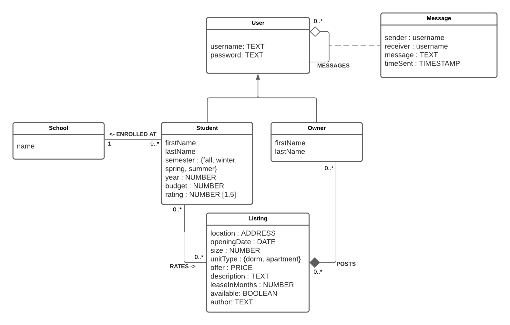
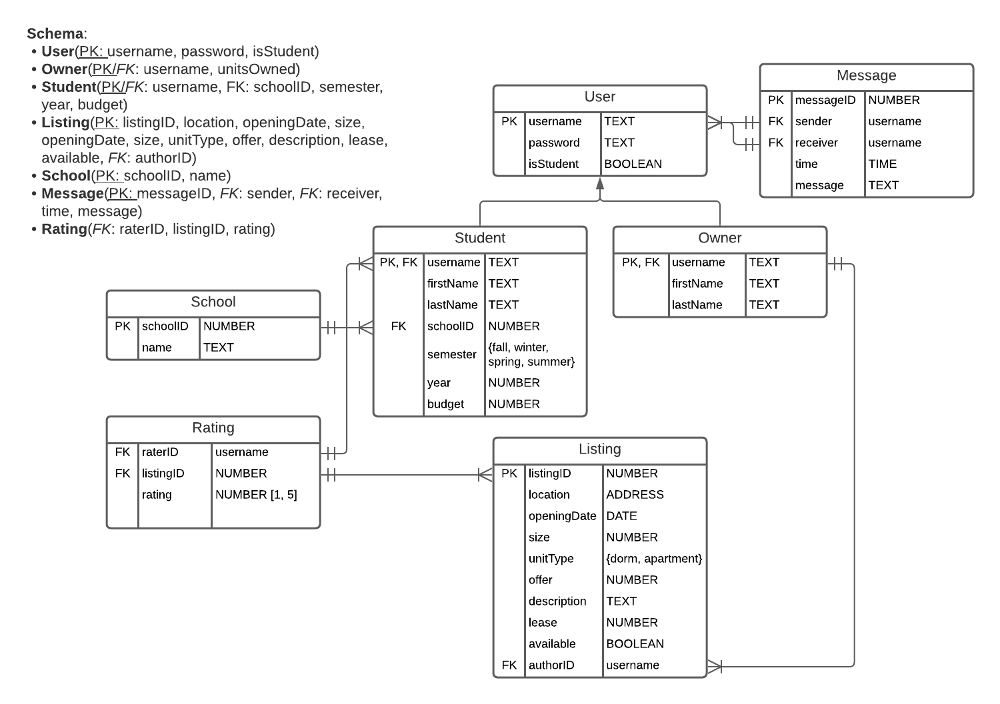

# StudentHousingFinder
Link to Business Requirement: https://docs.google.com/document/d/1HfzjBWUDes1UxDi9yob0D4R6YMiWGgLErjpFZMa3-3s/edit
# Project Objective:

An application that lets users explore a list of student housing.

It will support:
* CRUD dorm/apartment listings
* Sort alphabetically and filter by location/building, cost, or by user input
* Owner/renter (user) sign-up/login 
* CRUD user information
* Users can rate dorm/apartment listings
* Monthly/annual statistics for owners/renters*
* Favorites for users*
* *We were not able to finish implementing these items.

@Ely Lam implemented:
* Registering the owners and updating their listings as they post new housing listings.
* CRUD operations on the listings.
* CRUD operations on the messages between users and ensuring each message has one distinct sender and one distinct receiver.
* Making sure users are alloted separate accesses to listings than students are.

@Bernard Ekezie implemented:
* Registering the students and updating their ratings per listing.
* CRUD operations on the students and schools
* CRUD operations on the ratings
* CRUD operations on the user and ensuring users have a unique username and password.

## Authors:
Bernard Ekezie & Esther Lam

UML Diagram

ER Diagram

